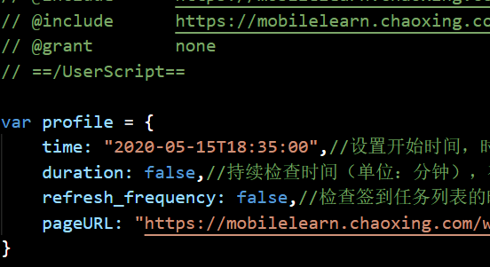

# TamperMonkey学习通自动签到脚本
2020年5月17日02点06分
注意，github在现在虽然可以打开，但是由于网络存在问题，在不开启代理的情况下无法加载图片。

## 功能介绍
这是一个用来实现自动签到的TamperMonkey脚本，以下为了方便称呼将TamperMonkey简称为“油猴”

1. 可以为不同的课程及开课时间进行单独设定
2. 可以设置持续检查时间，解决一些老师为了保证学生认真听课，排除不听课的学生而在课间进行二次签到的事情。
3. 后台自动执行，最小化去做别的事

## 缺陷

1. 不能进行较为复杂的签到方式，如九宫格手势签到

## 注意事项

1. 请不要关闭签到页面
2. 注意网络状态、电脑电源相关设置。避免由于断网、省电模式自动进入待机模式的情况发生
3. 注意日期的书写格式："YYYY-MM-DDTHH:mm:ss"

    举例：假设课堂开始时间为 739年2月2日2时2分2秒，必须写成 "0739-02-02T02:02:02"

## 准备事项

准备阶段1：确保安装了最新版的 [MicrosoftEdge](https://www.microsoft.com/zh-cn/edge) 浏览器

准备阶段2：安装在MicrosoftStore商店中安装[油猴插件](https://microsoftedge.microsoft.com/addons/detail/iikmkjmpaadaobahmlepeloendndfphd?hl=zh-CN)

准备阶段3：使用 MicrosoftEdge 登录[学习通](http://www.xuexi365.com/)网站

## 安装脚本

1. 点击油猴图标
2. 点击弹出窗口中的“管理面板”一栏
3. 点击“实用工具”一栏，再点击下方的“文件”一栏中的“选择文件”导入脚本

## 原理解释

这是一个非常简单的脚本，代码只有50行左右

整个脚本的结构为如下几个部分：
1. 配置参数
2. 签到行为逻辑
3. 循环检查逻辑

### 配置参数

1. 目标课程的签到页面地址
2. 目标课程的开课时间
3. 目标课程的持续时间
4. 检查签到列表的频率，以分钟为单位
- 第3、第4条，主要是为了针对一些老师“为了保证学生都在认真听课/刷掉不听课的学生”这样的目的，而不定时、不定期地在课程持续时间内的某一时刻突然发起二次签到的做法）

### 签到行为逻辑

- 模拟web端签到的具体过程，来实现“签到”。具体**签到动作**其实很简单，就是在签到列表上点击列表中的签到任务，触发元素的**点击事件**，然后会跳转到对应的签到结果页面。
- 签到列表页，如图：
- 签到结果页面，如图：

### 循环检查逻辑

这里就要先解释一下循环逻辑检查部分所遇到的情况。

在一个已经打开的页面定向到一个新的页面的具体过程为：
1. 浏览器首先发送请求到指定的url地址
2. 读取响应的信息（新的页面信息）
3. 调用新的渲染进程对其进行处理
4. 调用旧页面的渲染进程卸载（清除）当前页面及数据
5. 旧页面触发unload事件，进入Terminated状态，清除其占用的内存
6. 旧页面在unloaded事件结束后进入Discarded状态
7. 载入新的页面

***参考资料：***
- Google Developer : [Inside look at modern web browser (part 2) - Navigating to a different site](https://developers.google.com/web/updates/2018/09/inside-browser-part2#navigating_to_a_different_site)
- Google Developer : [Page Lifecycle API - States](https://developers.google.com/web/updates/2018/07/page-lifecycle-api#states)

上方描述的过程仅供参考，如发现错误并且愿意指出的话，请发送到邮箱apboisoft@outlook.com 并感谢您提出意见。

好了，这就是从旧页面跳转到新页面的大概过程。

由于页面跳转会清除旧的页面数据，也就意味着旧页面中所有JavaScript运行环境中的所有对象都会被清除，包括脚本。这对整个循环检查逻辑而言属于不可避免的问题。

同时，此脚本是基于浏览器插件TamperMonkey编写的。

简单介绍一下：
TamperMonkey是一个脚本管理插件，它是一个执行脚本文件的载体。
而其运行脚本的原理是触发式，意思是，只有在载入指定的页面后，才会触发执行对应的脚本。

具体的程序执行逻辑用语言描述太过繁琐，上示意图：

这就是这个程序的全部逻辑

## 使用方法

通过修改脚本内部的profile对象，来配置参数

time 对应的是课程开始时间

duration 对应的是课程的持续时间

refresh_frequency 对应的是检查签到列表的频率

pageURL 对应的签到列表页面的URL地址